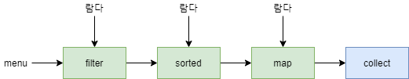

# moden java study2

## 스트림

- 자바 8의 스트림 API의 특징
  - 선언형 : 더 간결하고 가독성이 좋아진다
  - 조립할 수 있음 : 유연성이 좋아진다
  - 병렬화 : 성능이 좋아진다



## 컬렉션과 스트림

- 컬렉션은 현재 자료구조가 포함하는 모든 값을 메모리에 저장하는 자료구조
  - 컬렉션에 요소를 추가하거나 제거할 수 있으며, 컬렉션의 모든 요소는 컬렉션에 추가하기 전에 계산되어야 한다.
- 스트림은 이론적으로 요청할 때만 요소를 계산하는 고정된 자료구조
  - 한번만 소비할 수 있다.

### 필터링

- filter 메서드는 `Predicate`(불리언을 반환하는 함수)를 인수로 받아서 일치하는 모든 요소를 포함하는 스트림을 반환

```java
List<Dish> vegetarianMenu = menu.stream()
  .filter(Dish::isVegetarian)
  .collect(toList());

```

### 스트림 슬라이싱

- `TAKEWHILE` `DROPWHILE` `LIMIT` `SKIP`

```java
// 불가
IntStream.iterate(0, n -> n + 4)
   .filter(n -> n < 100)
   .forEach(System.out::println);
   
// 가능
IntStream.iterate(0, n -> n + 4)
   .talkWhile(n -> n < 100) //중간에 중단
   .forEach(System.out::println);
```

### 매핑

- map 메서드는 함수를 인수로 받는다. 제공된 함수는 각 요소에 적용되며 함수를 적용한 결과가 새로운 요소로 매핑

```java
List<Dish> disheNames = specialMenu.stream()
  .map(Dish::getName)
  .map(String::length)
  .collect(toList());
```

- ["Hello", "World"] 리스트가 있을때 ["H", "e", "l", "o", "W", "r", "d"] 
- flatmap과 Arrays.Stream 활용

```java
words.stream()
  .map(word -> word.split("")) //각 단어를 개별 문자열로 반환
  .flatMap(Arrays::stream) //생성된 스트림을 하나의 스트림으로 평면화
  .distinct()
  .collect(toList());
```

### 검색과 매칭

- `anyMatch` `allMatch` `noneMatch` `findAny` `findFirst`

### 리듀싱

- 모든 스트림 요소를 반복적으로 처리해서 결과를 도출하는 작업을 수행

```java
Optional<Integer> sum = numbers.stream().reduce(Integer::sum);
Optional<Integer> max = numbers.stream().reduce(Integer::max);
```

## 병렬 Stream

### 순차 스트림을 병렬 스트림으로 변환

```java
public long sequentialSum(long n) {
  return Stream.iterate(1L, i -> i + 1)
    .limit(n)
    .parallel() //병렬 스트림으로 변환
    .reduce(0L, Long::sum);
  }
  //reduce 연산이 병렬로 수행된다.
```

- 스트림이 여러 청크로 분할되어 각각 리듀싱 연산을 수행한 후 다시 리듀싱 연산으로 합쳐져 결과를 도출

### 과연 성능은 어떨까..

[ParallelStreamBenchmark.java](./src/main/java/chap7_parallel_stream/ParallelStreamBenchmark.java)

- 반복 결과로 박싱된 객체가 만들어지므로 숫자를 더하려면 언박싱을 해야한다.
  - 병렬처리가 항상 좋은 것만은 아니다
- 멀티코어 프로세서를 활용해서 효과적으로 병렬 연산을 실행하려면?
  - LongStream.rangeClosed
  - 기본형 long을 직접 사용하므로 박싱과 언박싱 오버헤드가 사라진다.
- 올바른 자료구조를 선택해야 병렬 실행도 최적의 성능을 발휘

### 병렬 stream 잘 사용하기?

- 공유된 상태를 바꾸는 알고리즘을 병렬 스트림으로 사용하면 문제가 발생

```java
public long sideEffectSum(long n) {
  Accumlator accumulator = new Accumulator();
  L ongStream.rangeClosed(1, n).forEach(accumulator::add);
  return acculator.total;
}
public long sideEffectParallelSum(long n) {
  Accumulator accumulaor = new Accumulator();
  LongStream.rangeClosed(1, n).parallel().forEach(accumultor::add);
  return accumulator.total;
}

public class Accumulator {
  public long total = 0;
  public void add(long value) { total += value; }
}
```

- 병렬 스트림이 올바르게 동작하기 위해서는 공유된 가변 상태를 피해야한다

### 몇가지 팁..?

- 확신이 서지 않을때는 순차 스트림과 병렬 스트림 구현 시의 성능을 직접 측정
- 자동 박싱과 언박싱은 성능을 크게 저하시킬 수 있는 요소이므로 주의해서 사용해야 하며, 기본형 특화 스트림(IntStream, LongStream, DoubleStream)을  사용하는 것이 좋다
- 자료구조가 적절한지 확인
  - ArrayList는 요소를 탐색하지 않고도 분할할 수 있지만 LinkedList는 모든 요소를 탐색해야 분할할 수 있다

