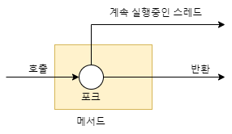
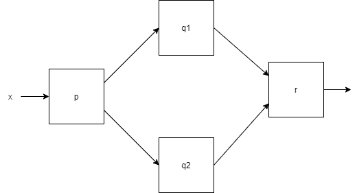

# modern java in action

## Completablefuture 리액티프 프로그래밍의 컨셉

- 복잡한 매시업 어플리케이션 구조에서 귀중한 cpu 클록 사이클을 낭비하고 싶지 않다
- 어플리케이션 생산성을 극대화 하도록 코어를 바쁘게 유지하는것이 목표
- 자바는 이러한 환경을 위해
  - Future인터페이스를 구현한 CompletableFuture 클래스를 제공
  - 자바 9에서는 발행 구독 프로코톨에 기반한 리액티브 프로그래밍 개념을 따르는 플로 API를 제공


```java
sum = Arrays.stream(stats).parallel().sum();
```

- 스트림을 이용해 스레드 사용 패턴을 (쉽게)추상화할 수 있다.

## Executor와 스레드 풀

- 스레드풀을 사용하면 하드웨어에 맞는 수의 태스크를 유지함과 동시에 수 천개의 태스크를 스레드 풀에 아무 오버헤드 없이 제출할 수 있다. 
- 큐의 크기 조정, 거부 정책, 태스크 종류에 따른 우선순위 등 다양한 설정을 할 수있다.


- 스레드풀을 이용할때는 두 가지 사항을 주의해야한다.
  - k 스레드를 가진 스레드 풀은 오직 k만큼의 스레드를 동시에 실행할 수있다. sleep 중이거나 I/O block 중인 스레드가 있다면 작업 효율성이 떨어지며, 데드락에 걸릴 수도 있다.
    - block 할 수 있는 태스크는 스레드에 제출하지 말아야하지만 이를 항상 지키긴 어렵다.
  - 모든 스레드 풀이 종료되기 전에 프로그램을 종료하면, 워커 스레드가 다음 태스크 제출을 기다리며 종료되지 않을 수 있으므로 주의해야한다.



- 이렇게 메서드가 반환된 후에도 만들어진 태스크 실행이 계속되는 메서드를 `비동기 메서드`라 한다
  - 스레드 실행은 메서드를 호출한 다음의 코드와 동시에 실행되므로 데이터 경쟁 문제를 일으키지 않도록해야 한다.
  - 기존 실행 중이던 스레드가 종료되지 않은 상황에서 자바의 main() 메서드가 반환되면 문제가 발생할 수 있다.

## 동기 API와 비동기 API

- 다음과 같은 예제를 살펴보자

```java
int f(int x);
int g(int x);

int y = f(x);
int z = g(x);
System.out.println(y + z);
```

- f,g 를 수행하는데 시간이 오래 걸린다면 다음과 같이 병렬수행할 수 있다.

```java
class ThreadExample {
  public static void main(String[] args) throws InterruptedException {
    int x = 1234;
    Result result = new Result();
    
    Thread t1 = new Thread(() -> { result.left = f(x); });
    Thread t2 = new Thread(() -> { result.right = g(x); });
    t1.start();
    t2.start();
    t1.join();
    t2.join();
    System.out.println(result.left + result.right);
  }
  
  private static class Result {
    private int left;
    private int right;
  }
}
```

- 여기서 Runnalbe 대신 Future API 인터페이스를 이용해 코드를 더 단순화할 수 있다.

```java
public class ExecutorServiceExample {
  pubvlic static void main(String[] args) throws ExecutionException, InterruptedException {
    int x = 1234;
    
    ExecutorService executorService = Executors.newFixedThreadPool(2);
    Future<Integer> y = executorService.submit(() -> f(x));
    Future<Integer> z = executorService.submit(() -> g(x));
    System.out.println(y.get() + z.get());
    
    executorService.shutdown();
  }
}
```

- 명시적인 submit 메서드 호출 같은 불필요한 코드로 오염되어 있다.
- 명시적 반복으로 병렬화를 수행하던 코드를 스트림을 이용해 내부반복으로 바꾼 것처럼, `비동기 API`라는 기능으로 API를 바꿔서 해결할 수 있다.

### Future 형식 API

```java
Future<Integer> f(int x);
Future<Integer> g(int x);

Future<Integer> y = f(x);
Future<Integer> z = g(x);
System.out.println(y.get() + z.get());
```

- f에만 future를 적용하면서 g를 그대로 호출할 수도 있지만, 두 가지 이유로 이런 방식을 사용하지 않는다.
  - 다른 상황에서는 g에도 future 형식이 필요할 수 있으므로 API 형식을 통일하는 것이 바람직하다.
  - 병렬 하드웨어로 프로그램 실행 속도를 극대화하려면 작고 합리적인 크기의 여러 태스크로 나누는 것이 좋다.

### 리액티브 형식 API

f, g의 시그니처를 바꿔 콜백 형식의 프로그래밍을 이용하는 것이다.

```java
void f(int x, IntConsumer dealWithResult);
```

- f가 값을 반환하지 않는데 어떻게 프로그램이 동작할까?
  - f에 추가 인수로 콜백(람다)을 전달해서 f의 바디에서는 return 문으로 결과를 반환하는 것이 아니라 결과가 준비되면 이를 람다로 호출하는 태스크를 만드는 것이 비결

```java
public class callbackStyleExample {
  public static void main(String[] args) {
    int x = 1337;
    Result result = new Result();
    
    f(x, (int y) -> {
      result.left = y;
      System.out.println(result.left + result.right);
    });
    
    
    g(x, (int z) -> {
      result.right = z;
      System.out.println(result.left + result.right);
    });
  }
}
```

- 하지만 결과가 달라졌다.   
- 값을 두번 출력할 수 있을 뿐더러 때로는 +에 제공된 두 피연산자가 println이 호출되기 전에 업데이트될 수도 있다.
  - if-then-else를 이용해 적절한 락을 이용해 두 콜백이 모두 호출되었는지 확인한 다음 원하는 기능을 수행한다.
  - 리액티브 형식의 API는 보통 한 결과가 아니라 일련의 이벤트에 반응하도록 설계되었으므로 Future를 이용하는 것이 더 적절하다.

- 계산이 오래 걸리는 메서스, 네트워크나 사람의 입력을 기다리는 메서드에 이들 API 를 활용하면 어플리케이션 효율이 크게 향상된다.

### 잠자기방지 (잠자기 및 블로킹은 해롭다)

스레드 풀에서 sleep중인 태스크는 다른 태스크가 시작되지 못하게 막으므로 자원을 소비한다.

예제를 통해 살펴보자

코드 A
```java
work1();
Thread.sleep(10000);
work2();
```

코드 B
```java
public class ScheduledExecutorServiceExample {
  public static void main(String[] args) {
    ScheduledExecutorService scheduledExecutorService = Executor.newScheduledThreadPool(1);
    
    work1();
    scheduledExecutorService.schedule(ScheduledExecutorServiceExample::work2, 10, timeUnit.SECONDS);
    //work1() 이 끝난다음 10초뒤에 work2() 를 개별 태스크로 스케쥴 함
    
    scheduledExecutorService.shutdown();
  }
  
  public static void work1() {
    ...
  }
  
  
  public static void work2() {
    ...
  }
}
```

- 코드 A는 sleep하는 동안 스레드 자원을 점유하는 반면, B는 다른 작업이 실행될 수 있도록 허용한다.
- 스레드에 제한이 없다면 두 코드는 동일하지만 스레드는 저렴하지 않고 제한이 있다!

## CompletableFuture와 콤비네이터를 이용한 동시성



```java
int t = p(x);
Future<integer> a1 = executorService.submit(() -> q1(t));
Future<integer> a2 = executorService.submit(() -> q2(t));
System.out.println(r(a1.get(), a2.get());
```

- 많은 태스크가 get() 메서드를 호출해서 Future가 끝나기를 기다리게 되면 하드웨어의 병렬성을 제대로 활용하지 못하거나 데드락에 걸릴 수도 있다

- CompletableFuture는 Future를 조합할 수 있는 기능이 있다.

```java
public class CFComplete {
  public static void main(String[] args) throws ExecutionException, InterruptedException {
    ExecutorService executorService = Executors.newFiexedthreadPool(10);
    int x = 1337;
    
    CompletableFuture<Integer> a = new CompletableFuture<>();
    executorService.submit(()-> a.complete(f(x)));
    int b = g(x);
    System.out.println(a.get()+b);
    
    executorService.shutdown();
  }
}
```

- f(x)와 g(x)를 동시에 실행해 합계를 구하는 위 코드에서, f(x)의 실행이 끝나지 않은 상황에서 get()을 기다리며 프로세싱 자원을 낭비할 수 있다.

- ComposableFuture<T>의 thenCombine 메서드를 사용하면 연산 결과를 효과적으로 더할 수 있다.

```java
ComposableFuture<V> thenCombine(CompletableFuture<U> other, Bifunction<T, U, V> fn)

public class CFComplete {
  public static void main(String[] args) throws ExecutionException, InterruptedException {
    ExecutorService executorService = Executors.newFiexedthreadPool(10);
    int x = 1337;
    
    CompletableFuture<Integer> a = new CompletableFuture<>();
    CompletableFuture<Integer> b = new CompletableFuture<>();
    
    CompletableFuture<Integer> c = a.thenCombine(b, (y, z) -> y + z);
    executorService.submit(()-> a.complete(f(x)));
    executorService.submit(()-> b.complete(g(x)));

    System.out.println(c.get());
    executorService.shutdown();
  }
}
```

- **연산 c는 다른 두 작업이 끝날때까지 실행되지 않으므로 먼저 시작해서` 블록되지 않는다`.**
- 이전 버전의 y+z 연산은 g(x)를 실행한 스레드에서 수행되어 f(x)가 완료될 때까지 블록될 여지가 있었다.
  - 반면 thenCombine을 이용하면 f(x)와 g(x)가 끝난 다음에 덧셈 계산이 실행된다.